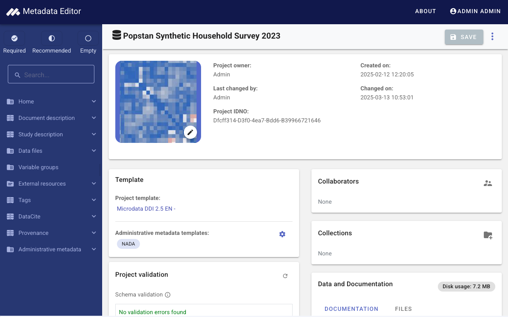

# Metadata Editor

The Metadata Editor is an open-source web-based application developed by the Office of the Chief Statistician at the World Bank. It is designed to assist data curators in documenting data of various types according to specialized metadata standards. The application currently supports the following data types and corresponding metadata standards:

- For **microdata** (from surveys, censuses, or other sources): [DDI CodeBook 2.5](https://ddialliance.org/ddi-codebook_v2.5).
- For **publications and reports**: [Dublin Core](https://www.dublincore.org/), enhanced with selected elements from other standards ([BibTeX](https://www.bibtex.org/), [MARC21](https://www.loc.gov/marc/bibliographic/)).
- For **indicators** (or time series): A custom metadata schema created by the World Bank by compiling metadata schemas from multiple organizations.
- For **geographic dataset and services**: [ISO 19139](https://www.iso.org/standard/67253.html) (ISO 19115 / ISO19110 / ISO19119).
- For **images**: [IPTC](https://iptc.org/standards/photo-metadata/iptc-standard/) and [Dublin Core](https://www.dublincore.org/).
- For **videos**: A combination of [Dublin Core](https://www.dublincore.org/) and elements from [schema.org](https://schema.org/).
- For **research projects and scripts**: A custom metadata schema created by the World Bank.

The metadata schemas supported by the Metadata Editor are detailed at https://worldbank.github.io/metadata-schemas

## Getting Started

### Server Requirements

* PHP version 7 or later
* MySQL/MariDB
* Apache, IIS or NGINX

### Installation

See [Installation guide](https://worldbank.github.io/metadata-editor-docs/tech_installation.html)

### Documentation

See [Documentation](https://worldbank.github.io/metadata-editor-docs)

## License

This project is licensed under the MIT License with a short rider ([IGO-LICENSE-ADDENDUM](IGO-LICENSE-ADDENDUM.md)) that preserves the World Bank’s IGO status without limiting use. Please review both files before reuse or contribution.

