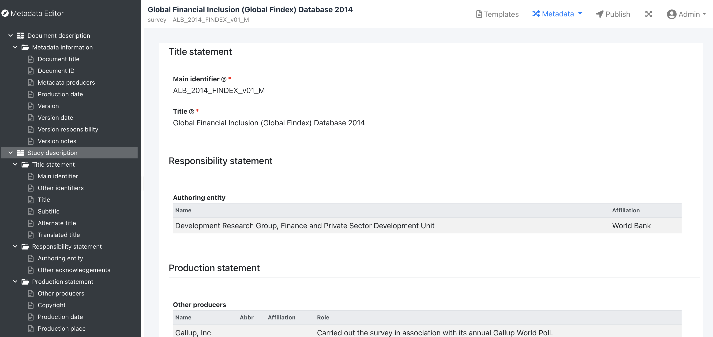

# Metadata Editor

Metadata Editor is an open-source web-based editor designed to help users document metadata using multiple standards. 

The supported data types are:

- DDI CodeBook 2.5
- Document - based on the Dublin Core standard
- Table
- Image - [IPTC](https://iptc.org/standards/photo-metadata/iptc-standard/) and Dublin Core
- Video - Dublin Core
- Time series (Indicators)
- Geospatial (ISO 19139)
- Script (custom)

## Getting Started

### Server Requirements

* PHP version 7 or later
* MySQL or Microsoft SQL Server database
* Apache, IIS or NGINX

### Installation

See [Installation guide](https://ihsn.github.io/editor/#/installation)

### Documentation

see [Documentation](https://ihsn.github.io/editor/#/)

## Authors

* **IHSN** - [International Household Survey Network](http://ihsn.org)

## License

This project is licensed under the MIT License - see the [license.txt](license.txt) file for details

